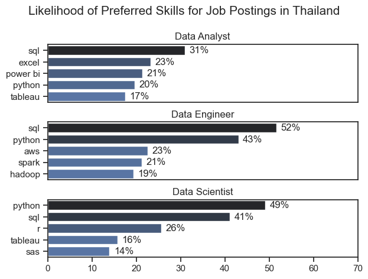
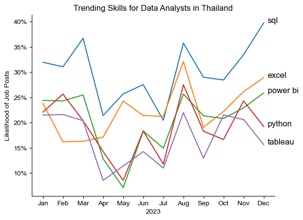
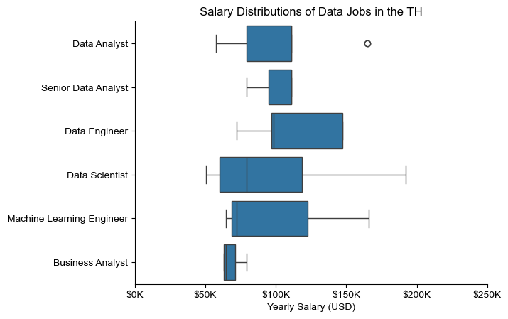
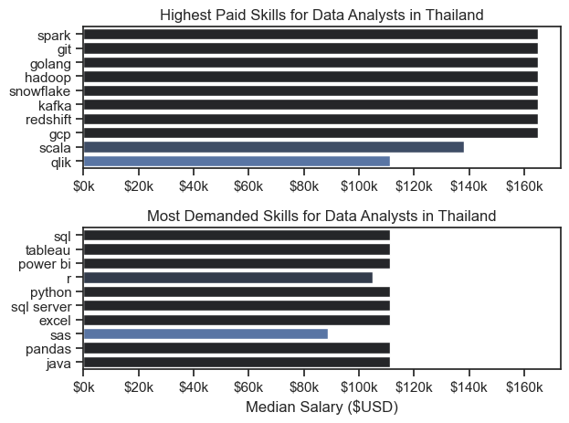
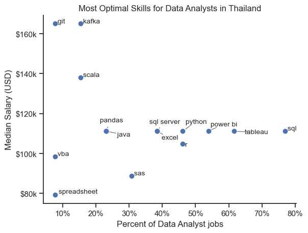

# Overview
Welcome to my analysis of the data jobs market, with a focus on Data Analyst roles. This project was driven by my curiosity to better understand and navigate the data job market. It explores the top-paying and most in-demand skills to help job seekers identify opportunities in data analytics. 

The data was sourced from Luke Barousse’s Python Course, which provides valuable insights for this analysis. The dataset contains detailed information on job titles, salaries, locations, and preferred skills. Using this data, I explored the most in-demand skills and salary trends within the data analytics field.

# The Questions
Here are the questions I aim to answer in this project:
1. What skills are most in demand for the top three data roles?
2. How do skill demand trends change over time for Data Analysts?
3. What are the typical salary ranges for Data Analysts?
4. Which skills offer the best combination of high demand and high salary for Data Analysts?

# Tool I Used
To analyze the data analyst job market in depth, I leveraged several key tools:

- **Python**: The primary tool used for this analysis, enabling data processing and the extraction of meaningful insights. I utilized the following Python libraries:
   - **Pandas**: Used for data manipulation and analysis
   - **Matplotlib**: Used for data visualization
   - **Seaborn**: Used to create more advanced and visually appealing charts
- **Jupyter Notebooks**: Used to run Python scripts while documenting notes and analysis in an interactive environment.
- **Visual Studio Code**: Used to write, test, and execute Python scripts.
- **Git & GitHub**: Used for version control and for sharing the analysis code.

# Data Preparation
This section details the steps taken to prepare the data for analysis.

## Import and cleanup Data
I started by importing the necessary libraries, loading the dataset, and cleaning the data to ensure it was ready for analysis.

```python
import ast 
import pandas as pd
import seaborn as sns
import matplotlib.pyplot as plt
from datasets import load_dataset

#load dataset
dataset = load_dataset('lukebarousse/data_jobs')
df = dataset['train'].to_pandas()

#clean data
df['job_posted_date'] = pd.to_datetime(df['job_posted_date'])
df['job_skills'] = df['job_skills'].apply(lambda x: ast.literal_eval(x) if pd.notna(x) else x)
```
## Filter TH jobs
To focus specifically on the Thailand job market, I filtered the dataset to include only roles based in the Thailand.

```python
df_TH = df[df['job_country'] == 'Thailand']
```

# The Analysis
In this project, each Jupyter notebook explores a specific aspect of the data job market. Below is my approach to each question:

## 1. What skills are most in demand for the top three data roles?
To explored the most in-demand skills across the three most popular data roles. By narrowing the dataset to the most frequently posted positions, I identified the top five skills for each role. This analysis highlights which skills matter most for different data roles, offering guidance on where to focus when targeting a specific career path.

View the full notebook with detailed steps here: [2_Skill_Demand](3_Project/2_Skill_Demand.ipynb).

### Visualize Data
```python
#plot skills perc
fig, ax = plt.subplots(len(job_titles), 1)

sns.set_theme(style='ticks')
for i, job_title in enumerate(job_titles):
    df_plot = df_perc[df_perc['job_title_short'] == job_title].head(5)[::-1]
    sns.barplot(data=df_plot, x='skill_percent', y='job_skills', ax=ax[i], hue='skill_percent', palette='dark:b_r')
    ax[i].set_title(job_title)
    ax[i].invert_yaxis()
    ax[i].set_ylabel('')
    ax[i].set_xlabel('')
    ax[i].get_legend().remove()
    ax[i].set_xlim(0, 70)

#remove x_axis ticks for readability
    if i != (len(job_titles) - 1):
        ax[i].set_xticks([])

#label percentages on bars
    for n, v in enumerate(df_plot['skill_percent']):
        ax[i].text(v + 1, n, f'{v:.0f}%', va='center')

fig.suptitle('Likelihood of Preferred Skill for Job Postings in Thailand', fontsize=15)
fig.tight_layout(h_pad=0.8)
plt.show()
```
### Results


*Bar graph comparing salaries across the top three data roles, highlighting the five most important skills for each role.*

### Insights:
- SQL was identified as a core skill across data roles, appearing in over half of job postings for both Data Analysts and Data Engineers. In contrast, Python was the most in-demand skill for Data Scientists, featured in approximately 49% of postings.
- Data Engineers require more specialized technical skills, such as AWS, Hadoop, and Spark, reflecting their focus on data infrastructure. Meanwhile, Data Analysts and Data Scientists are expected to be proficient in more general data analysis and management tools, including Excel and Tableau.
- Data Scientists also show demand for statistical and analytical programming skills, such as SAS and R.

## 2. How do skill demand trends change over time for Data Analysts?
To understand how data analyst skills trended throughout 2023, I filtered the dataset to focus on data analyst roles and grouped skills by the month of each job posting. This allowed me to identify the top five skills for each month, revealing how skill demand evolved over the year.

View the notebook with detailed steps here: [3_Skills_Trend](3_Project/3_Skills_Trend.ipynb).

### Visualize Data
```python
#plot percentage skills trend
from matplotlib.ticker import PercentFormatter

df_plot =df_DA_TH_perc.iloc[:, :5]
sns.lineplot(data=df_plot, dashes=False, legend='full', palette='tab10')
sns.set_theme(style='ticks')
sns.despine()

plt.title('Trending Skills for Data Analysts in Thailand')
plt.ylabel('Likelihood of Job Posts')
plt.xlabel('2023')
plt.legend().remove()
plt.gca().yaxis.set_major_formatter(PercentFormatter(decimals=0))

#annotate the plot with the top 5 skills
for i in range(5):
    plt.text(11.2, df_plot.iloc[-1, i], df_plot.columns[i], color='black')

plt.show()
```
### Results


*Bar graph showing the top trending skills for Data Analysts in Thailand.*

### Insights:
- SQL and Excel show steady demand throughout the year, with a noticeable increase toward the end of the year. This suggests that these foundational skills remain essential and become even more important during peak business and reporting periods.
- Power BI demonstrates high demand at the beginning of the year, followed by a decline in the mid-year period. However, demand gradually increases again toward the end of the year, indicating its continued relevance for business intelligence and performance reporting.
- Python and Tableau experience higher demand in the early part of the year but show a decline toward the year’s end. This trend may reflect a shift from exploratory or advanced analytical projects earlier in the year to more standardized reporting and operational tasks later on.
- These trends indicate that skill demand for Data Analysts is influenced by business cycles, reinforcing the importance of maintaining a balanced skill set that includes both foundational tools (SQL, Excel) and advanced analytical tools (Python, BI platforms).

## 3. What are the typical salary ranges for Data Analysts?
To identify the highest-paying roles and skills, I focused on job postings in Thailand and analyzed their median salaries. I began by examining the salary distributions of common data roles, such as Data Scientist, Data Engineer, and Data Analyst, to gain a clearer understanding of which positions offer the highest pay.

View the notebook with detailed steps here: [4_Salary_Analysis](3_Project/4_Salary_Analysis.ipynb).

### Visualize Data
```python
sns.boxplot(data=df_TH_top6, x='salary_year_avg', y='job_title_short', order=job_order)
sns.set_theme(style='ticks')
sns.despine()

# this is all the same
plt.title('Salary Distributions of Data Jobs in the TH')
plt.xlabel('Yearly Salary (USD)')
plt.ylabel('')
plt.xlim(0, 250000) 
ticks_x = plt.FuncFormatter(lambda y, pos: f'${int(y/1000)}K')
plt.gca().xaxis.set_major_formatter(ticks_x)
plt.show()
```

### Results


*Box plot showing salary distributions for the six most popular data job titles.*

### Insights:
- Machine Learning Engineers and Data Engineers have the highest median salaries, while Business Analysts earn the lowest, indicating that roles requiring deeper technical expertise tend to offer higher compensation.
- Data Scientists show the widest salary distribution and notable outliers, suggesting that experience, specialization, and niche skills can lead to significantly higher pay.
- Senior Data Analysts earn noticeably more than Data Analysts, demonstrating clear salary growth with increased experience, although analyst roles still earn less than engineering-focused positions.
- Roles that require stronger programming, data engineering, or machine learning skills tend to command higher salaries in Thailand data job market.

### Highest Paid & Most Demanded Skills for Data Analysts
Next, I focused specifically on Data Analyst roles. The analysis explored both the highest-paying and most in-demand skills, visualized using two bar charts.

### Visualize Data
```python
#plot 2 horizontal bar chart
fig, ax = plt.subplots(2, 1)

#Top 10 Highest Paid Skills for Data Analysts
sns.barplot(data=df_DA_top_pay, x='median', y='job_skills', hue='median', ax=ax[0], palette='dark:b_r')
ax[0].legend().remove()
ax[0].set_title('Highest Paid Skills for Data Analysts in Thailand')
ax[0].set_ylabel('')
ax[0].set_xlabel('')
ax[0].xaxis.set_major_formatter(plt.FuncFormatter(lambda x, _: f'${int(x/1000)}k'))

#Top 10 Most Demanded Skills for Data Analysts
sns.barplot(data=df_DA_skills, x='median', y='job_skills', hue='median', ax=ax[1], palette='dark:b_r')
ax[1].legend().remove()
ax[1].set_title('Most Demanded Skills for Data Analysts in Thailand')
ax[1].set_ylabel('')
ax[1].set_xlabel('Median Salary ($USD)')
ax[1].set_xlim(ax[0].get_xlim())
ax[1].xaxis.set_major_formatter(plt.FuncFormatter(lambda x, _: f'${int(x/1000)}k'))

sns.set_theme(style='ticks')
plt.tight_layout()
plt.show()
```
### Results


*Two bar graphs showing the highest-paying and most in-demand skills for Data Analysts in Thailand.*

### Insights:
- Advanced technical skills such as Spark, Git, and Golang are associated with the highest salary levels, reaching up to 160,000 USD, despite appearing less frequently in job postings.
- In contrast, high-demand skills such as SQL, Tableau, and Power BI appear in a larger number of job postings but are associated with relatively lower salary levels compared to more advanced skills.
- This highlights a clear gap between market demand and salary potential. Skills that command higher salaries tend to be more advanced, specialized, and technically complex, despite being requested in fewer job postings
- The findings suggest that individuals aiming for higher salary should develop advanced technical skills alongside widely demanded foundational skills, balancing market demand with salary potential.

## 4. Which skills offer the best combination of high demand and high salary for Data Analysts?
To identify the most optimal skills to learn (those that are both highly paid and in high demand), I calculated the percentage of job postings requiring each skill alongside their median salaries. This approach makes it easier to identify skills that offer the best balance between demand and compensation.

View the notebook with detailed steps here: [5_Optimal_Skills](3_Project/5_Optimal_Skills.ipynb).

### Visualize Data
```python
#plot scatter plot
from adjustText import adjust_text
from matplotlib.ticker import PercentFormatter

plt.scatter(df_DA_skills_high_demand['skill_percent'], df_DA_skills_high_demand['median_salary'])
plt.xlabel('Percent of Data Analyst jobs')
plt.ylabel('Median Salary (USD)')
plt.title('Most Optimal Skills for Data Analysts in Thailand')

#get current axes, set limit, format axes
ax = plt.gca()
ax.yaxis.set_major_formatter(plt.FuncFormatter(lambda y, _: f'${int(y/1000)}k'))
ax.xaxis.set_major_formatter(PercentFormatter(decimals=0))

#Add label to points
texts = []
for i, txt in enumerate(df_DA_skills_high_demand.index):
    texts.append(plt.text(df_DA_skills_high_demand['skill_percent'].iloc[i], df_DA_skills_high_demand['median_salary'].iloc[i], " " + txt, fontsize=10))

#adjust text to avoid overlap and add arrow
adjust_text(
    texts,
    arrowprops=dict(arrowstyle='-', color='gray', lw=1.0, shrinkA=10, shrinkB=5),
    expand_points=(4.0, 4.0),
    expand_text=(3.0, 3.0),
    force_points=1.0,
    force_text=1.0
)
sns.despine()
plt.show()
```
### Results


*Scatter plot showing the most valuable skills for Data Analysts in Thailand (high salary and high demand).*

### Insights:
- Version control and streaming technologies, such as Git and Kafka, offer the highest salary levels but appear in a relatively small number of job postings, indicating niche and highly specialized demand.
- Skills associated with mid-range salaries, including SQL, Power BI, Python, and Tableau, show significantly higher demand in the job market. These skills align with core data visualization, programming, and analytical tasks.
- These mid-salary skills form the foundational skill set of a Data Analyst, balancing technical capability with broad market demand.
- The analysis suggests that possessing mid-range salary skills significantly increases job opportunities in the data analytics field, making them an effective entry point for individuals pursuing a career as a Data Analyst.

# What I Learned
This project helped me better understand how the data job market values different skills across roles and salary levels. By exploring skill demand, trends, and compensation, I gained insight into how market needs shape career opportunities in data analytics.

From a technical perspective, I strengthened my Python skills through hands-on work with real-world datasets. I became more confident in cleaning and transforming data, as well as in communicating insights through clear and effective visualizations.
### Key takeaways:
- Practical experience with core Python libraries, including Pandas, Matplotlib, and Seaborn, across an end-to-end data analysis workflow
- A deeper understanding of data cleaning, recognizing its direct impact on analytical accuracy and insight quality
- Improved confidence in data visualization, enabling clearer explanation and communication of data-driven findings

# Insights
This project revealed several key insights into the data analyst job market:
- **Balanced Skill Demand**: The data analyst job market places strong value on a balanced skill set that combines foundational abilities with emerging technical capabilities, reflecting the need for both stability and adaptability in the role.
- **Core Skill Importance**: Foundational skills such as SQL, Python, and BI tools continue to be essential across most data analyst positions due to their consistent demand and broad applicability in real-world business scenarios.
- **Advanced Skill**: While advanced and specialized skills can command higher salaries, they are often required for more niche roles and are not always the most widely demanded across the market.

# Challenges I Faced
Throughout this project, I faced several challenges:
- **Inconsistent Data**: Some records contained missing or incomplete information, which made certain analyses and visualizations more challenging. This required additional data cleaning and careful handling to avoid misleading results.
- **Visualization Complexity**: Designing charts that included more detailed information while remaining clear and readable was challenging, especially when comparing multiple variables within a single visualization

# Conclusion
This project offered valuable insights into the data analyst job market, highlighting key skills, trends, and salary differences. While advanced skills may enhance earning potential, fundamental skills such as SQL and Python remain important, as they are widely used and consistently in demand. These findings can guide anyone interested in pursuing a career in data analysis or developing their skill set. Since the market keeps changing, regularly analyzing trends is essential to staying ahead in data analytics.

Overall, the project established a strong foundation for future learning and emphasized the importance of continuous skill development and adapting to changes in the field.

